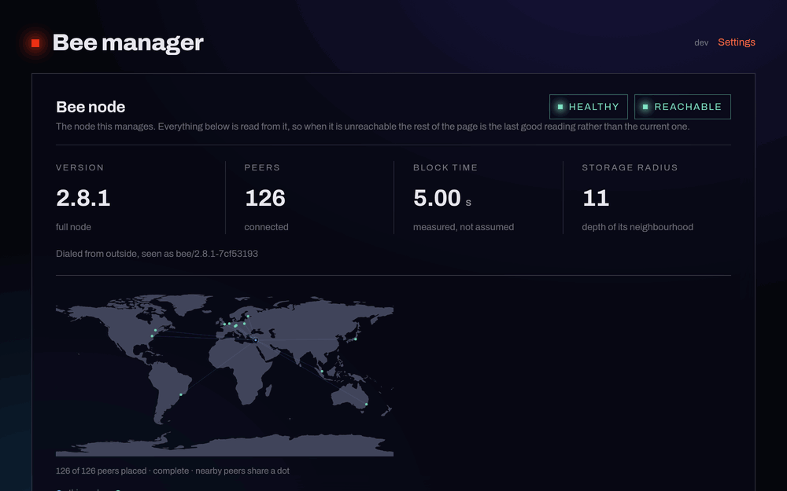

# swarm-stamp-monitor

Keeps Swarm postage batches alive, and makes what they cost impossible to miss.

The Swarm dashboard can buy and top up batches but cannot do it automatically, so
a batch lapses silently — and when it does, the chunks it stamped are dropped from
storer reserves and the data is gone. This watches the batches, tops them up
within hard spend caps, and gives dapps an API to upload through so the Bee node
itself never has to face the internet.



*Overview, a batch, its 65,536 buckets as a map, and the settings. Rendered from
the real build against representative data — the figures, addresses and batch IDs
above are invented, not a live node's.*

## The thing worth understanding

A batch is charged for **reserved capacity, not stored data**. At depth `d` you
rent `2^d` chunks every block whether you use them or not, so an empty batch
expires exactly as fast as a full one. Depth does not change how long a batch
lives — it multiplies what that lifetime costs:

| depth | capacity | cost / 30 days* |
|---|---|---|
| 17 | 537 MB | 0.48 BZZ |
| 20 | 4.3 GB | 3.84 BZZ |
| 24 | 68.7 GB | 61.44 BZZ |

<sub>* at a chain price of 70,638 PLUR/chunk/block. Identical lifetime in every row.</sub>

Those capacities are **nominal**. Chunk addresses are effectively random, so the
65,536 buckets fill unevenly and the first one reaches capacity long before the
batch does — a birthday problem. Measured by simulation:

| depth | nominal | first bucket full at | ratio |
|---|---|---|---|
| 17 | 131,072 chunks (537 MB) | ~311 chunks (1.3 MB) | 421x |
| 18 | 262,144 chunks (1.07 GB) | ~7,815 chunks (32 MB) | 34x |
| 19 | 524,288 chunks (2.15 GB) | ~67,850 chunks (278 MB) | 8x |
| 20 | 1,048,576 chunks (4.3 GB) | ~277,432 chunks (1.1 GB) | 4x |

What happens at that point is where the two batch types stop being comparable:

- **immutable** — the whole batch reports 100% utilised and refuses every
  further upload. That figure is its real capacity.
- **mutable** — that one bucket starts recycling its oldest chunk. The batch
  keeps working and keeps accepting; it is simply lossy from there, and more so
  as more buckets fill. It never gets full, so the figure is not a limit but the
  onset of silent data loss.

Shallow batches are hit hardest, which cuts against "just buy a smaller one":
depth 17 is the cheapest row and also the one whose usable share is 0.2%.

Over-provisioning is therefore the usual reason stamps keep lapsing: the batch is
so expensive that the wallet only ever buys a couple of months. Depth can be
*increased* (dilute) but never reduced, so right-sizing means a new batch and a
re-upload. The wizard exists to make that trade visible before you commit to it.

## Dilution

Dilution is the only way to add capacity to a batch that exists: raise the depth
by one and it rents twice as many chunks. Depth only ever goes up.

It is not free, and the price is not paid in xBZZ. **Diluting halves the
remaining life.** The amount already deposited is per-chunk, so spreading it
over twice as many chunks buys half as long:

| | before | after dilute to 19 |
|---|---|---|
| capacity | 1.07 GB | 2.15 GB |
| remaining life | 9.1 d | **4.6 d** |

That gives an ordering rule with real money behind it: **dilute first, top up
second.** Topping up to 60 days and then diluting throws away 30 of them. The
planner enforces this — a dilute plan carries the follow-up top-up with it and
computes the cost from the *post-dilution* depth, so what the caps check is what
will actually be spent.

### When it happens on its own

With `diluteEnabled`, a managed batch dilutes when its fullest bucket crosses the
threshold — the default 80%, *or* "one slot left", whichever comes first. The
second clause exists because `utilizationRatio` is `maxCollisions / 2^(depth-16)`
and so is quantised: at depth 17 the only possible values are 0, 0.5 and 1. A
fixed 0.8 is unreachable there until the ratio is exactly 1.0, by which point a
bucket is already full and the guard has fired after the damage.

Below depth 19 even that is too eager — with two slots per bucket, a batch
holding a single chunk already reads 0.5, and walking 17→22 would halve the
remaining life five times and pay for five restoring top-ups on a batch that was
essentially empty. So shallow batches trigger only once a bucket is genuinely
full. That is reactive by design: on a *mutable* batch a full bucket costs one
recycled chunk, which is far cheaper than repeatedly halving a batch's life.

> On a shallow **immutable** batch that trade does not hold — a full bucket
> there means the batch refuses every upload, so auto-dilute rescues it rather
> than pre-empting it. Deep immutable batches are fine; they hit the one-slot
> rule long before anything fills.

`maxAutoDiluteDepth` (default 24) bounds this: each step doubles what the batch
costs per day, so an unbounded rule would answer "this batch is full" by making
it permanently expensive.

### Doing it by hand

Any batch can be diluted from its page, managed or not, and immutability is no
obstacle — verified against Bee's `DiluteBatch`, which checks only that depth
increases, and the on-chain `increaseDepth`, which never reads `immutableFlag`.
For an immutable batch that has filled a bucket this is the *only* repair.

The preview shows the new depth, the new capacity, the halved life and what
restoring it to target would cost, before anything is signed.

## Sizing

Duration is `price x blocks`, priced from the chain. It cannot be derived from a
batch's own `amount / batchTTL` — `amount` is the **cumulative** per-chunk value
ever deposited, not the remaining balance, so that ratio overstates the burn rate
(by 1.687x on the batch this was built against). Block time is *measured* from
successive `chainstate.block` values rather than assumed.

All money is `bigint` end to end. A wallet balance like `2044839309272645597`
is not representable as a JS `Number` — it comes back as `…645632`.

## Safety

Nothing spends until **both** `AUTO_TOPUP_ENABLED=true` and `DRY_RUN=false`.
On top of that, every action is checked before submission against:

- a per-action BZZ cap,
- a rolling 24h BZZ cap,
- a minimum wallet balance floor,
- a minimum xDAI balance, so the transaction can actually land.

A blocked action raises an alert rather than passing silently — "I would have
topped up but the cap stopped me" is the message that must not be lost. Actions
are written to the ledger as `submitted` *before* the Bee call, so a crash
mid-transaction leaves evidence instead of a duplicate on the next poll.

### Timeouts on writes are indeterminate, never failures

Buying, topping up and diluting are on-chain transactions. **Abandoning the HTTP
request does not cancel the transaction** — it can still be mined minutes later.
So a write that times out client-side raises `BeeIndeterminateError`, the action
stays `submitted` (which is what blocks a retry), and the caller is told not to
retry. Recording it as `failed` would both under-count the daily spend cap and
invite buying the same thing twice.

Writes therefore get their own budget (`BEE_WRITE_TIMEOUT_MS`, default 5 min)
rather than the read timeout (`BEE_TIMEOUT_MS`, 15s). Found the hard way: a
15-second timeout on a batch purchase returned an error, recorded `failed`, and
the batch appeared on the node three minutes later regardless.

## The upload API

Dapps POST to this service instead of to Bee, which is what lets the node come
off the public internet — `/wallet`, `/chequebook` and `/stake` stop being
reachable.

```
POST /api/apps/:app/upload    -> { reference }
GET  /api/apps/:app/stamp     -> { batchId, ttlDays, utilizationRatio, usable }
```

Auth is a per-app API key (pipelines, which can hold a secret) or an EIP-191
wallet signature over the content hash and a timestamp (browsers, which cannot).
**Signatures do not stop Sybil abuse** — addresses are free to mint. Quotas bound
the loss instead: per-request size, per-address bytes and count, and a per-app
daily byte budget that is the actual blast radius.

Limits follow the auth method, because an API key is a real secret and a wallet
is not: 64 MB per request for key-authenticated pipelines, 5 MB for signatures.
The shared per-app daily budget is *not* raised for pipelines — it bounds a bad
day for both.

### Deploying a site

The endpoint accepts a tar as a directory, using Bee's own header names, so an
existing deploy script only needs its URL changed:

```sh
curl -X POST "https://stamps.example.org/api/apps/mysite/upload" \
  -H "x-api-key: $DEPLOY_KEY" \
  -H "Swarm-Collection: true" \
  -H "Swarm-Index-Document: index.html" \
  -H "Swarm-Error-Document: index.html" \
  -H "Content-Type: application/x-tar" \
  --data-binary @<(cd dist && tar cf - .)
# -> {"reference":"…"}
```

Point an ENS content hash at that reference and the site is live. This is the
path that lets the Bee node itself stay off the internet.

## xBZZ vs BZZ

Every amount this service reports — wallet balance, batch cost, burn rate, caps,
top-ups — is **xBZZ**: the Gnosis-side token, mainnet BZZ bridged 1:1 via
Omnibridge. That is what the Bee node's wallet actually holds, and it is why the
gas figure beside it reads xDAI rather than DAI. The UI ticker is defined once,
as `TOKEN` in `web/src/api.ts`, so the two cannot drift apart.

**BZZ** appears in exactly two places, both deliberate:

- the market quote (`BZZ $0.0416`), which prices the underlying asset — there is
  no separate liquid market for the bridged form worth quoting;
- the environment variable names `MAX_TOPUP_BZZ_PER_BATCH`,
  `MAX_TOPUP_BZZ_PER_DAY` and `MIN_WALLET_BZZ`, which are a deployment contract.
  Renaming them for cosmetic consistency would silently drop the configured
  values back to defaults — one of them is a spend guard. `test/config-env-names.test.ts`
  pins them for that reason.

Fiat is display-only and never enters a spending decision; see `src/price.ts`.

## Immutable by default

Batches are bought **immutable** unless you ask otherwise, and the wizard always
asks rather than letting a default pass unseen — inheriting one silently is how
two batches were bought immutable by accident.

The difference is only what happens when a bucket fills. An immutable batch
refuses the write. A mutable one discards the oldest chunk in that bucket, with
no error, so a reference you published simply stops resolving one day. For data
meant to persist, refusing is the better failure.

Immutability does **not** prevent topping up, and does not prevent dilution
either — verified against Bee's `DiluteBatch`, which checks only that depth
increases, and the on-chain `PostageStamp.increaseDepth`, which never reads
`immutableFlag`. Dilution is in fact the only way to recover an immutable batch
that has filled a bucket, since at that point it refuses every upload.

Choose mutable for something rewritten often — a site you redeploy, a rolling
cache — where recycling superseded chunks is what you want.

## Managing apps

```sh
GET    /api/admin/apps            # the registry
GET    /api/admin/apps/by-batch   # which apps share which batch
DELETE /api/admin/apps/:name      # remove a registry entry
```

Deleting an app is **registry-only** — it never touches the batch. Several apps
can point at the same batch, so removing one must not abandon a stamp another is
still uploading with; the response reports which apps still reference that batch,
and retiring the batch itself stays a separate, explicit act. Upload history is
kept, so re-registering a name does not hand it a fresh daily quota.

## Fire-and-forget stamps

The poller renews every batch it sees, which is wrong for a deliberately
short-lived one — share a file with friends, let it lapse. Two ways to opt out:

```sh
# by label, applied automatically the first time the batch is seen
POST /api/admin/wizard/buy  {"depth":17,"days":3,"label":"tmp-holiday-pics","confirm":true}

# or explicitly, at any time
PATCH /api/admin/batches/<id>  {"managed": false}
```

An unmanaged batch is never topped up or diluted, and raises no low-TTL or
"disappeared" alert — its expiry is the intended outcome, not an incident. It
still appears in the dashboard and in snapshots while it lives.

The label prefix is `UNMANAGED_LABEL_PREFIX` (default `tmp-`). Unknown batches
always default to *managed*, so an upgrade or a lost database can never silently
stop maintaining something you rely on.

## Renaming a batch

```sh
PATCH /api/admin/batches/<id>  {"label": "photos-2026"}
```

Labels are writable on the node (`PATCH /stamps/{id}`, JSON only — verified on
Bee 2.8.1), so this is a real rename, not a local alias: it is what other tools
see, and it survives this service losing its database. Editable inline in the
dashboard.

Renaming a batch to the unmanaged prefix does **not** change whether it is
managed — the two are deliberately independent, because a rename quietly
altering spending behaviour is the kind of coupling that surprises you later.
Note that anything discovering batches by label (t4t's own manager matches
`T4T_STAMP_LABEL`) will stop finding a batch you rename.

## Running

```sh
cp .env.example .env      # BEE_URL, caps, webhook
docker compose up -d      # joins the Bee node's network; dashboard on :3010
```

## Authentication

All of it lives in the application — there is no proxy-level auth to rely on.

| Surface | Credential |
|---|---|
| `/api/admin/*`, node passthrough | `x-admin-token` |
| `/bytes`, `/bzz`, `/stamps` | per-app `x-api-key` (or wallet signature) |
| the dashboard page itself | none — it is inert without a token |

**It fails closed.** If no admin token is configured, the admin API and the node
passthrough return `503` rather than running unauthenticated. Refusing to serve
is a visible outage; serving without auth is a silent one — and these routes buy
postage batches.

Supply it as `ADMIN_TOKEN_FILE` (a docker swarm secret, so it stays out of git
and out of `docker service inspect`) or `ADMIN_TOKEN` for local runs.

```sh
bun install && bun test   # 120 tests
bun src/dryrun.ts         # one read-only poll: state and intended actions
```

## Layout

| Path | |
|---|---|
| `src/math.ts` | BigInt PLUR/BZZ, durations, capacity, runway |
| `src/wizard.ts` | Sizing: quotes, depth ladder, recommendations, warnings |
| `src/evaluate.ts` | Top-up / dilute decisions and the spend caps. Pure — never calls Bee |
| `src/poller.ts` | The loop: measure, record, decide, act |
| `src/quota.ts` `src/auth.ts` | Public upload limits and authentication |
| `src/server.ts` | Admin API, public API, dashboard |
| `web/` | Dashboard |
